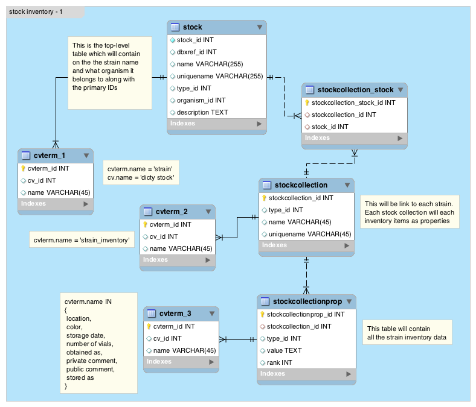
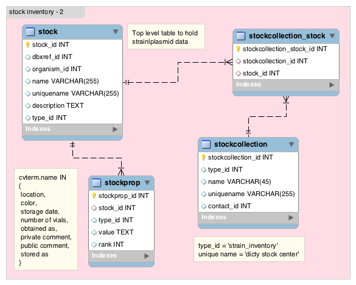

## Data model for stock inventory

### Rationale
Inventory is not a biological property of the `stock`. `stock` can have multiple inventories. In our case, the maximum number of inventories a `stock` has is 5. `stockcollection` is the stock center which dictributes the stock(strains). In our case, we have only one `stockcollection` - _'dicty stock center'_. 

[Chado](http://gmod.org/wiki/Chado_Tables#Table:_stock) schema does not directly support storing inventory data.  

### Data Models
We propose 2 models to store the inventory data in Chado schema.

1. Inventory is the property of the `stockcollection`
2. Inventory is the property of the `stock`

#### Model-1
Here inventory data is saved in `stockcollectionprop` table. `stockcollection` will contain
```perl
{
	name => 'dicty stock center',
	uniquename => <DBS ID>,
	type_id => <WHERE cvterm.name = 'strain_inventory'>
}
```
Each stock (strain|plasmid) will have a `stockcollection` entry. If one stock has multiple inventories, they will be grouped by `rank` in the `stockcollectionprop` table.


#### Model-2
In this case, the inventory is the property of the `stock` itself. There will be only two `stockcollection` entries
```perl
{
	uniquename => 'dicty stock center'
	type_id => <WHERE cvterm.name IN ('strain_inventory', 'plasmid_inventory')>
}
```
All the strains will have the same `stockcollection`, and all the plasmids will have a single `stockcollection`. The inventory data will be saved in the `stockprop` table.

